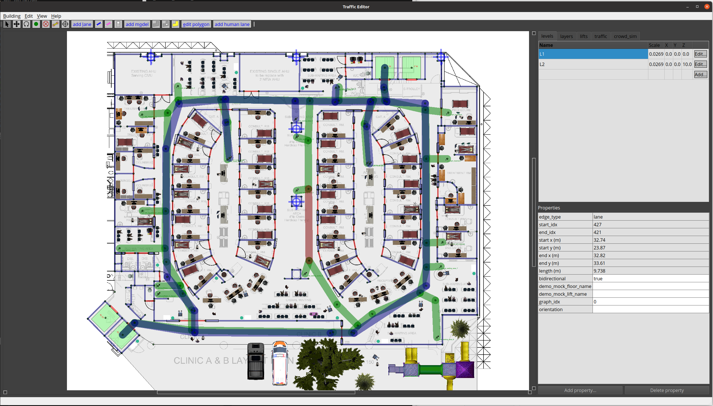
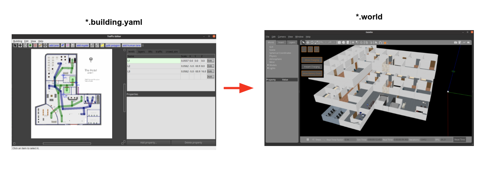

[](https://github.com/osrf/traffic_editor/actions/workflows/ci.yaml)
[](https://github.com/osrf/traffic_editor/actions/workflows/pycodestyle.yaml)

# rmf_traffic\_editor

Welcome!



This repository has the following directories:
 * `rmf_traffic_editor`: GUI for annotating floorplans to create traffic patterns
 * `rmf_building_map_tools`: Python-based tools to use and manipulate the map files created by `rmf_traffic_editor`, such as:
   * `building_map_server`:  a ROS 2 node to serve maps using `rmf_building_map_msgs`
   * translators to simulators such as Gazebo
   * translators to navigation packages such as `rmf_core` (e.g. `rmf_ros2`)
   * scripts that handle downloading of gazebo models. `pit_crew`, `building_map_model_downloader`...
 * `rmf_traffic_editor_assets`: Gazebo model thumbnails, in used by `traffic_editor` GUI

## Installation

This repository is structured as a collection of ROS 2 packages and can be built using `colcon`.
For full installation of RMF, please refer to [here](https://github.com/open-rmf/rmf).

The `rmf_building_map_tools` package requires the following Python 3 dependencies to generate worlds:

```
sudo apt install python3-shapely python3-yaml python3-requests
```

## Usage

`rmf_traffic_editor` consists of a interface and tools to create a simulation `.world` file from a sketched building floor plan.
These simulation  `.world` file can be used by other applications, not just limited to RMF.



### Traffic Editor GUI

Instructions of `traffic_editor` is located [here](https://osrf.github.io/ros2multirobotbook/traffic-editor.html)

To run traffic_editor GUI, run:
```bash
source install/setup.bash
traffic-editor
```

### Building Map Tools
Once done with the editing of the building map with `traffic_editor`, user can now generate the simulated world file from the saved  `.building.yaml` file (`${building_map_path}`).

**Generate a world file from building map**
```bash
ros2 run rmf_building_map_tools building_map_generator gazebo \
  ${building_map_path} ${output_world_path} ${output_model_dir}
```
_switch arg `gazebo` to `ignition` for generating a world file for ignition_

**Download models used in newly created traffic editor building map.**
```bash
ros2 run rmf_building_map_tools building_map_model_downloader \
  ${building_map_path} -f -e ~/.gazebo/models
```

**Generate Traffic Navigation Path File**
```bash
ros2 run rmf_building_map_tools building_map_generator nav \
  ${building_map_path} ${output_nav_graphs_dir}
```
